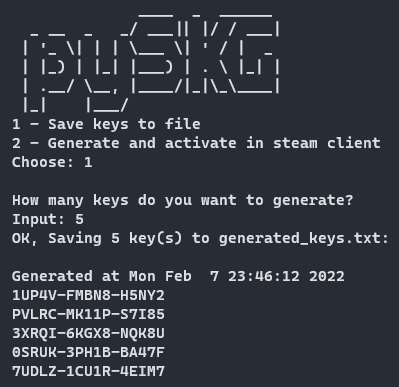
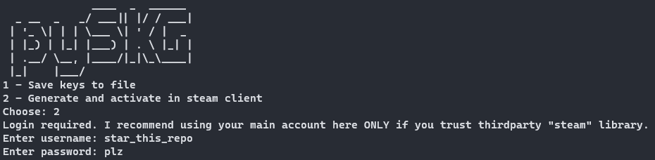

# pySKG
### <b>Rofl</b> steam keys generator script with some cool features.

### [Download here](https://codeload.github.com/KUKURUZKA165/pySKG/zip/refs/heads/main)

### Installation:

Install dependecies:
```
pip install steam
```

Launch:
```
python pySKG.py
```

### Changelog and plans:
- [x] Generate keys.
- [x] Save results to file.
- [x] Activate generated keys trough steam.
- [x] Do it automatically.
- [ ] Do it without authorization.
- [ ] GUI? (never lol)

### Screenshots:



[steam_tools.py code was taken from here. Thanks @kenx00x and @Fhoughton for good usage example!](https://github.com/Fhoughton/Steam-Key-Sniper/blob/master/SteamKeySniper.py)
